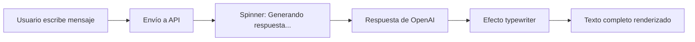

# 🦖 Asistente Draftosaurus

Chatbot interactivo especializado en el juego de mesa **Draftosaurus**, diseñado para ayudar a jugadores nuevos y experimentados con reglas, estrategias y dudas durante las partidas.


> 🔒 **Seguridad**: Este proyecto NO expone credenciales. Ver [SECURITY.md](SECURITY.md) para más información.

---

## 📋 Descripción

Este proyecto es un chatbot web que funciona como asistente virtual para el juego de mesa **Draftosaurus**. Utiliza la API de OpenAI para proporcionar respuestas precisas y contextuales sobre:

- 📖 Reglas del juego (versión verano e invierno)
- 🎲 Mecánicas de draft y dado de restricción
- 🏆 Sistemas de puntuación por recintos
- 💡 Estrategias para principiantes y avanzados
- 🧩 Expansiones (Marina, Aerial Show)
- ❓ Resolución de dudas durante la partida

---

## ✨ Características

### 🎨 Diseño Visual
- **Tema naturaleza/bosque**: Paleta de colores verde y naranja con degradados
- **Animaciones ambientales**:
  - Hojas cayendo con rotación y movimiento
  - Partículas flotantes simulando polen
  - Efecto de viento suave en el header
- **Diseño responsive**: Optimizado para desktop y móvil
- **Glassmorphism**: Efectos de blur y transparencia modernos

### 💬 Experiencia de Chat
- **Efecto typewriter**: El texto se escribe progresivamente como ChatGPT
- **Spinner de carga**: Animación mientras se genera la respuesta
- **Cursor parpadeante**: Indica que el asistente está escribiendo
- **Renderizado Markdown**: Soporta negritas, listas, títulos, código, etc.
- **Historial de conversación**: Mantiene el contexto de toda la sesión
- **Sugerencias rápidas**: 5 preguntas predefinidas para comenzar

### 🧠 System Prompt Avanzado
- Conocimiento exhaustivo de reglas oficiales
- Información de recintos, especies y restricciones
- Cobertura completa de ambas caras del tablero (verano/invierno)
- Modo 2 jugadores y variantes especiales
- FAQ de reglas comunes
- Guiones para facilitar el flujo de partida

---

## 🚀 Tecnologías

### Frontend
- **HTML5**: Estructura semántica
- **CSS3**: Animaciones, gradientes, flexbox
- **JavaScript ES6+**: Async/await, Promises, DOM manipulation

### APIs y Librerías
- **OpenAI API**: Backend para procesamiento de lenguaje natural
- **Marked.js**: Parseador de Markdown a HTML
- **Font Awesome 6**: Iconos vectoriales (dragón, usuario, avión)
- **Google Fonts**: Tipografía Nunito

### Backend
- **API Endpoint**: `https://backend-pasamanos-openai.onrender.com/chat`
- **Método**: POST con payload JSON
- **Formato**: `{messages: [{role, content}, ...]}`

---

## 📁 Estructura del Proyecto

```
ChatBox-Draftosaurus/
├── index.html                        # Estructura HTML principal
├── css/
│   └── styles.css                   # Estilos, animaciones y responsive
├── js/
│   ├── script.js                    # Lógica del chat y animaciones
│   ├── config.js                    # Configuración de API (gitignored) 🔒
│   └── config.example.js            # Plantilla de configuración
├── docs/
│   └── draftosaurus_system_prompt.md # System prompt para la IA
├── assets/
│   └── favicon.ico                  # Icono del sitio
├── .gitignore                       # Archivos excluidos de Git
├── .env.example                     # Ejemplo de variables de entorno
├── README.md                        # Documentación del proyecto
└── SECURITY.md                      # Política de seguridad 🔒
```

---

## 🛠️ Instalación y Uso

### Requisitos Previos
- Navegador web moderno (Chrome, Firefox, Edge, Safari)
- Conexión a internet (para APIs y CDNs)

### Instalación Local

1. **Clonar o descargar el repositorio**
   ```bash
   git clone <url-del-repo>
   cd ChatBox-Draftosaurus
   ```

2. **Abrir el proyecto**
   - Simplemente abre `index.html` en tu navegador
   - O usa un servidor local:
   ```bash
   # Con Python
   python -m http.server 8000

   # Con Node.js (http-server)
   npx http-server
   ```

3. **Acceder a la aplicación**
   - Abre `http://localhost:8000` en tu navegador
   - ¡Listo! Ya puedes empezar a hacer preguntas

### Despliegue en Producción

#### 🚀 Netlify (RECOMENDADO)

**Despliegue seguro con Netlify Functions** para proteger tu API key:

```bash
# 1. Sube a GitHub
git push origin main

# 2. Conecta con Netlify
# Ir a https://app.netlify.com → Add new site → Import from Git

# 3. Configura variables de entorno en Netlify:
# Site settings → Environment variables → Add:
#   OPENAI_API_URL = https://tu-backend.com/chat
```

📖 **Guía completa**: Ver [DEPLOY.md](DEPLOY.md) para instrucciones detalladas paso a paso.

#### GitHub Pages (Solo para demo)

⚠️ **No recomendado en producción** - expone la API en el cliente

1. Sube el proyecto a GitHub
2. Settings → Pages → Selecciona rama main
3. Disponible en `https://tu-usuario.github.io/repo`

---

## 💡 Cómo Funciona

### Flujo de Interacción



### Arquitectura del System Prompt

El asistente tiene conocimiento estructurado en secciones:

1. **Visión general del juego**
2. **Componentes y preparación** (por número de jugadores)
3. **Estructura de partida** (rondas, turnos, draft)
4. **Recintos cara Verano** (6 zonas + río + T-Rex)
5. **Dado de restricción** (6 caras posibles)
6. **Cara Invierno** (recintos avanzados)
7. **Modo 2 jugadores** (reglas especiales)
8. **Puntuación y desempates**
9. **FAQ de reglas rápidas**
10. **Guiones para guiar partidas**

---

## 🎨 Paleta de Colores

| Color | Hex | Uso |
|-------|-----|-----|
| Verde Principal | `#6aa84f` | Botones, spinner, borders |
| Verde Claro | `#8bc34a` | Gradientes, hover |
| Naranja Principal | `#ffb347` | Títulos, mensajes usuario |
| Naranja Oscuro | `#ff8c42` | Degradados |
| Fondo Oscuro | `#1a2a35` | Background principal |
| Verde Medio | `#2d4a3e` | Background gradiente |

---

## 🔧 Configuración de API

⚠️ **IMPORTANTE - Seguridad de Credenciales**

Este proyecto está diseñado para **NO exponer** credenciales en el código. Todas las configuraciones sensibles se manejan a través de un archivo local que **NO se sube a Git**.

### 🔐 Configuración Segura

1. **Copiar archivo de ejemplo**
   ```bash
   cp js/config.example.js js/config.js
   ```

2. **Editar `js/config.js`** con tus valores reales:
   ```javascript
   const CONFIG = {
       API_URL: 'https://tu-backend-api.com/chat',
       // API_KEY: 'sk-tu-api-key-real' // Descomenta si tu API requiere autenticación
   };
   ```

3. **Verificar que esté en .gitignore**
   ```bash
   # js/config.js ya está incluido en .gitignore
   # NUNCA hagas commit de este archivo
   ```

### ✅ Verificación de Seguridad

Antes de hacer push a GitHub, verifica:

```bash
# Ver archivos que se subirán
git status

# Asegúrate que js/config.js NO aparezca en la lista
# Si aparece, ejecuta:
git rm --cached js/config.js
```

### 🛡️ Protección Implementada

- ✅ `js/config.js` está en `.gitignore`
- ✅ No hay URLs hardcodeadas en el código
- ✅ No hay API keys en el código fuente
- ✅ El código verifica que exista configuración antes de usarla
- ✅ Se incluye `config.example.js` como plantilla

---

## 🔧 Configuración Avanzada

### Modificar Velocidad de Escritura

En `js/script.js`, busca la función `typewriterEffect()`:

```javascript
const charsPerStep = 3;  // Caracteres por paso (1-5 recomendado)
const interval = 20;     // Milisegundos (10-50 recomendado)
```

### Cambiar Cantidad de Animaciones

En `js/script.js`, funciones `generateLeaves()` y `generateParticles()`:

```javascript
// Hojas iniciales
const initialLeaves = 8 + Math.floor(Math.random() * 5); // 8-12 hojas

// Intervalo de generación
setInterval(() => createLeaf(), 3000 + Math.random() * 3000); // 3-6 seg
```

### Personalizar el System Prompt

Edita `docs/draftosaurus_system_prompt.md` entre los marcadores:

```markdown
<!-- SYSTEM_PROMPT_START -->
Tu prompt personalizado aquí...
<!-- SYSTEM_PROMPT_END -->
```

---

## 📱 Responsive Design

El diseño se adapta automáticamente a diferentes tamaños de pantalla:

| Breakpoint | Cambios |
|------------|---------|
| **Desktop** (>600px) | Diseño completo con todas las animaciones |
| **Mobile** (<600px) | Títulos más pequeños, chat más compacto, botones ajustados |

---

## 🐛 Troubleshooting

### El spinner no aparece
- Verifica que `styles.css` esté correctamente vinculado
- Revisa la consola del navegador (F12) para errores

### El efecto typewriter no funciona
- Asegúrate de que `marked.js` esté cargado desde el CDN
- Verifica que todas las funciones estén definidas en `script.js`

### Las animaciones de hojas no se ven
- Recarga la página con Ctrl+F5 (limpia caché)
- Verifica que el CSS tenga las clases `.leaf` y `.particle`

### Error de CORS al cargar el system prompt
- El archivo `.md` debe estar en el mismo dominio
- Para desarrollo local, usa un servidor HTTP

---

## 🤝 Contribuciones

Las contribuciones son bienvenidas. Para cambios importantes:

1. Fork el proyecto
2. Crea una rama para tu feature (`git checkout -b feature/AmazingFeature`)
3. Commit tus cambios (`git commit -m 'Add: Amazing Feature'`)
4. Push a la rama (`git push origin feature/AmazingFeature`)
5. Abre un Pull Request

---

## 📄 Licencia

Este proyecto es de código abierto y está disponible bajo la licencia MIT.

---

## 👨‍💻 Autor

Desarrollado como proyecto educativo para aprender integración con APIs de IA y diseño de interfaces conversacionales.

---

## 🙏 Agradecimientos

- **Draftosaurus** - Ankama Editions (juego de mesa original)
- **OpenAI** - API de procesamiento de lenguaje natural
- **Font Awesome** - Iconos vectoriales
- **Marked.js** - Parseador de Markdown
- **Google Fonts** - Tipografía Nunito

---

## 📞 Contacto

¿Preguntas, sugerencias o bugs? Abre un issue en el repositorio.

---

<div align="center">

**[⬆ Volver arriba](#-asistente-draftosaurus)**

Hecho con 💚 y muchos dinosaurios 🦕🦖

</div>
